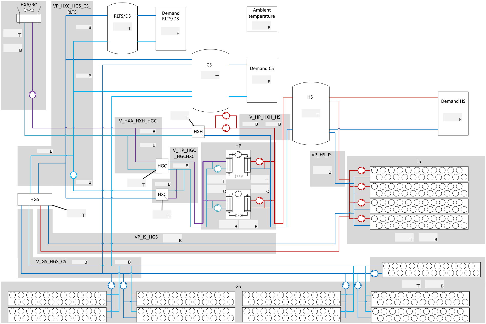

# rtMPCuGC: Real-time MPC operation optimization of a commercial building under grid constraints

This repository provides the Python code for a Model Predictive Control (MPC) simulation of an innovative building located in Karlsruhe, Germany. 

The MPC simulation includes the following files:
* the three model files `binary_model`, `linear_binary_model` and `long_term_model`, which describe the energy system dynamics and the corresponding costs
* the `optimal_control` file, which orchestrates the integration of the three model files
* the warm-start files `warmstart_binary_model` and `warmstart_linear_binary_model`, which decompose and solve the optimization problem in sequential steps to provide an initial feasible solution for the main optimization
* the interface files `forecast_interface`, `measurements_interface`, `optimization_results_interface`, `market_Interface` and `modelica_interface`, which provide a variety of connection options to run the simulation model in a closed-loop-MPC simulation or a Dymola-MPC simulation loop
* the `run_control` file, which sets parameters and initiates the simulation workflow.

## Energy system model

The energy system model consists of the following components:

## Version

This version of the MPC simulation is a minimal implementation that includes a closed-loop MPC setup. Therefore, all interfaces are configured to load and store only optimization results. For completeness, all Modelica/`Dymola` [\[1\]](#ref-1) interface components used in the original version are retained but commented out.

## Requirements

The Python packages required for running the minimal implementation code are:

`Pandas` [\[2\]](#ref-2), `Numpy` [\[3\]](#ref-3)[\[4\]](#ref-4) and `Pyomo` [\[5\]](#ref-5).

Furthermore, to run the optimization problem, `Gurobipy` [\[6\]](#ref-6) is recommended and set as the default solver. A valid Gurobi license is required.

## Running the MPC

To test the model, import the `run_control` file, and execute the `loop()` function.

## References

[1]  Dassault Systèmes SE (2024). Dymola. https://www.3ds.com/products/catia/dymola 

[2]  The pandas development team. (2025). pandas-dev/pandas: Pandas (v2.3.0). Zenodo. https://doi.org/10.5281/zenodo.15597513

[3]  Harris, C.R., Millman, K.J., van der Walt, S.J. et al. Array programming with NumPy. Nature 585, 357–362 (2020). DOI: 10.1038/s41586-020-2649-2. 

[4]  Bynum, Michael L., Gabriel A. Hackebeil, William E. Hart, Carl D. Laird, Bethany L. Nicholson, John D. Siirola, Jean-Paul Watson, and David L. Woodruff. Pyomo - Optimization Modeling in Python. Third Edition Vol. 67. Springer, 2021.

[5]  Hart, William E., Jean-Paul Watson, and David L. Woodruff. "Pyomo: modeling and solving mathematical programs in Python." Mathematical Programming Computation 3(3) (2011): 219-260.

[6]  Gurobi Optimization, LLC (2024). Gurobi Optimizer Reference Manual. https://www.gurobi.com
